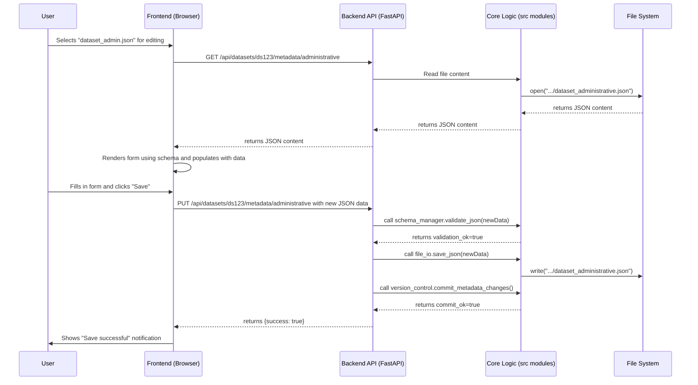

```mermaid
sequenceDiagram

participant User

participant Frontend (Browser)

participant Backend API (FastAPI)

participant Core Logic (src modules)

participant File System


User->>Frontend (Browser): Selects "dataset_admin.json" for editing

Frontend (Browser)->>Backend API (FastAPI): GET /api/datasets/ds123/metadata/administrative

Backend API (FastAPI)->>Core Logic (src modules): Read file content

Core Logic (src modules)->>File System: open(".../dataset_administrative.json")

File System-->>Core Logic (src modules): returns JSON content

Core Logic (src modules)-->>Backend API (FastAPI): returns JSON content

Backend API (FastAPI)-->>Frontend (Browser): returns JSON content

Frontend (Browser)->>Frontend (Browser): Renders form using schema and populates with data

User->>Frontend (Browser): Fills in form and clicks "Save"

Frontend (Browser)->>Backend API (FastAPI): PUT /api/datasets/ds123/metadata/administrative with new JSON data

Backend API (FastAPI)->>Core Logic (src modules): call schema_manager.validate_json(newData)

Core Logic (src modules)-->>Backend API (FastAPI): returns validation_ok=true

Backend API (FastAPI)->>Core Logic (src modules): call file_io.save_json(newData)

Core Logic (src modules)->>File System: write(".../dataset_administrative.json")

Backend API (FastAPI)->>Core Logic (src modules): call version_control.commit_metadata_changes()

Core Logic (src modules)-->>Backend API (FastAPI): returns commit_ok=true

Backend API (FastAPI)-->>Frontend (Browser): returns {success: true}

Frontend (Browser)->>User: Shows "Save successful" notification
```